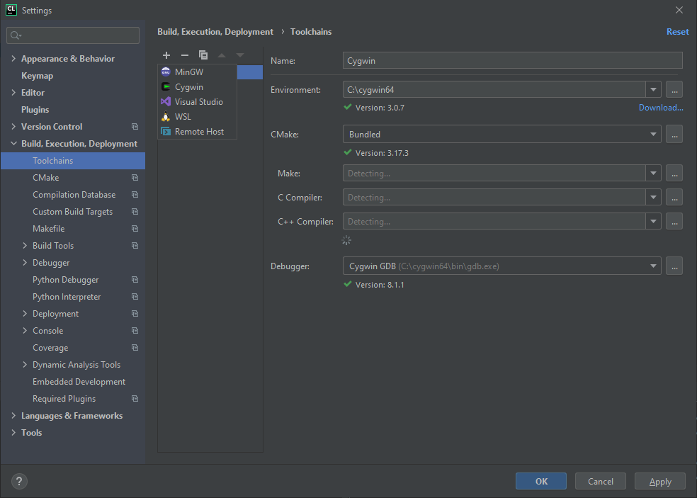
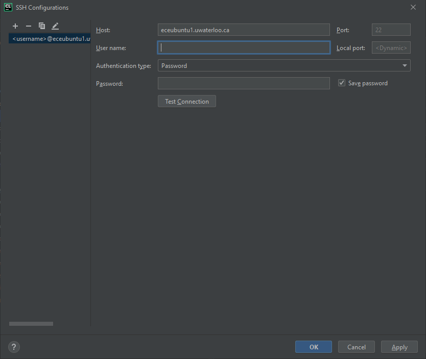
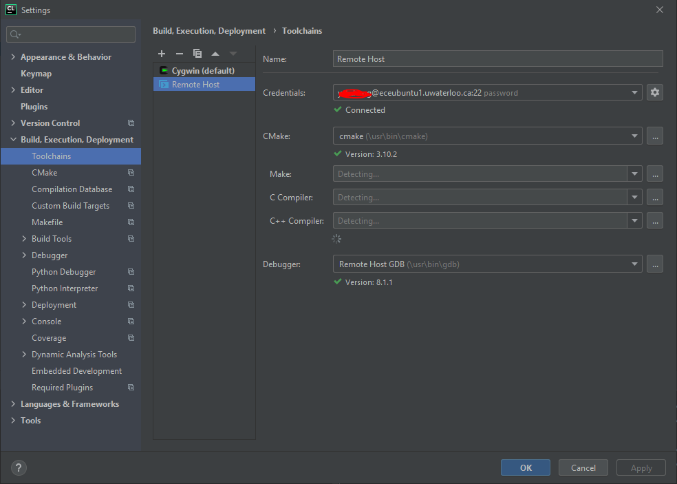
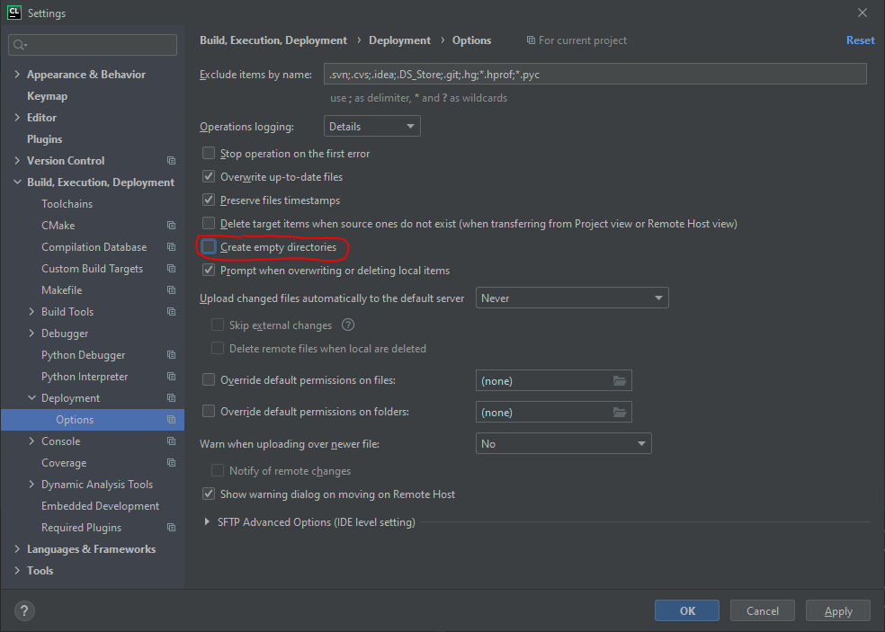
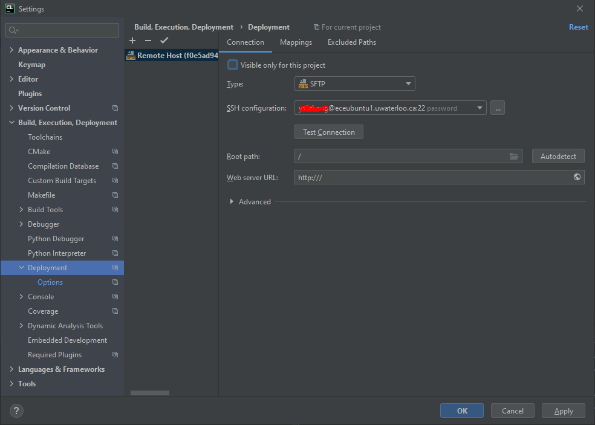
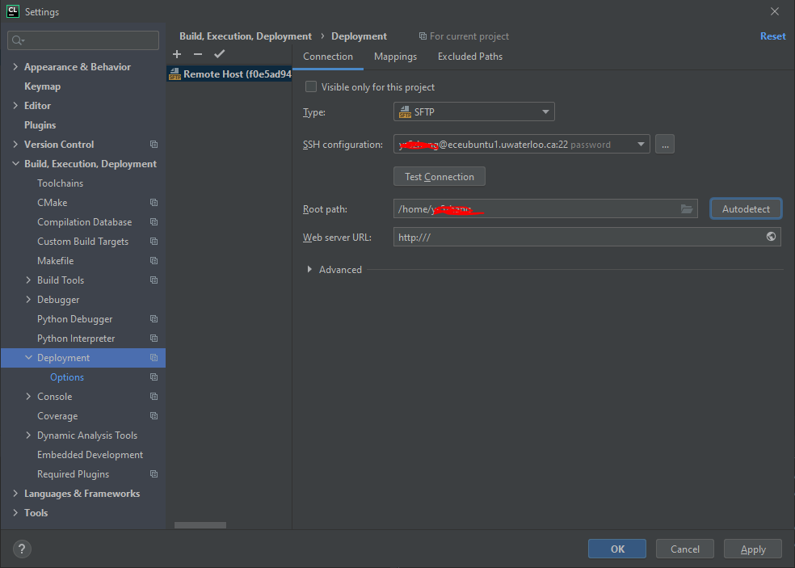
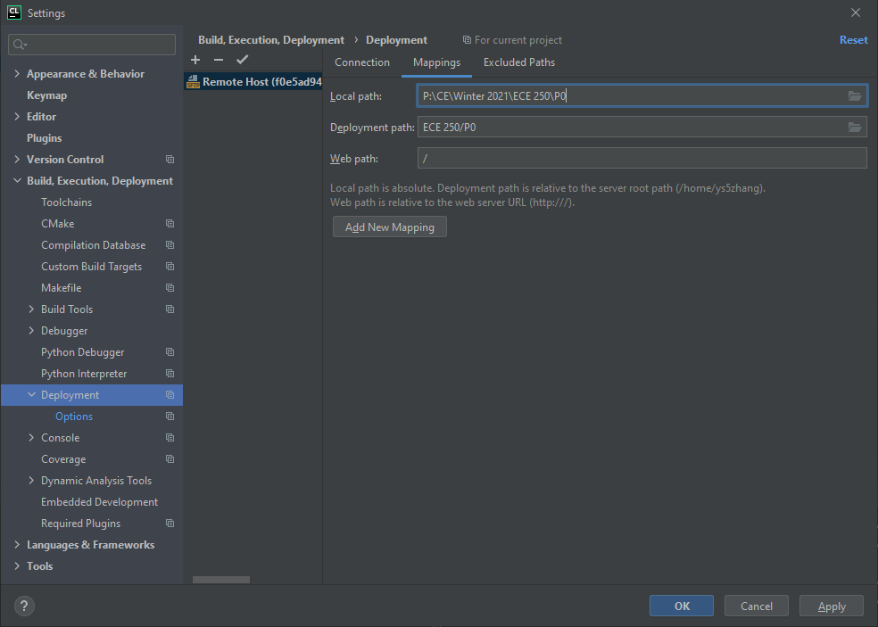
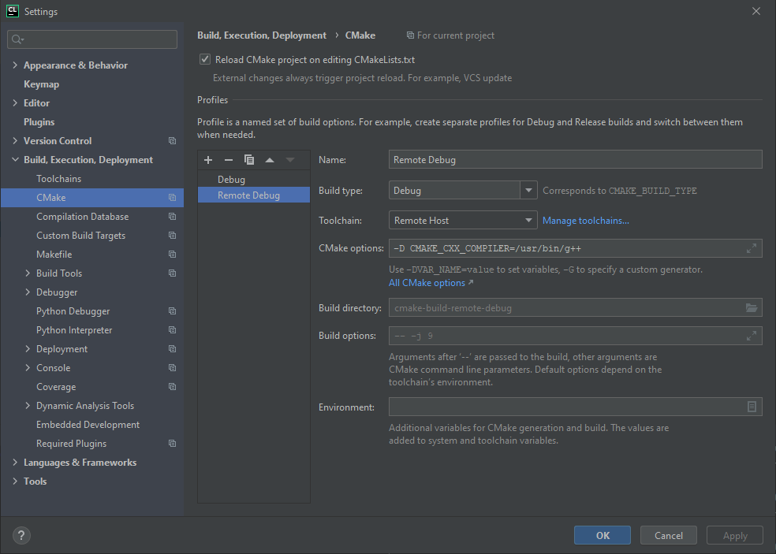
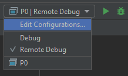

# Remote Linux Debugging on ECE Ubuntu Servers in Clion
The following are steps to run your c++ code on the ECE Ubuntu servers for testing.

**This tutorial assumes that you have already created a Clion project. Please click apply after you make each change**

Changes to project folder will be automatically synced to ECE Ubuntu every time you change a file. Clion may not sync file deletions correctly.
## Requirements
You must be able to connect to the University of Waterloo VPN.

## Install Clion
Visit https://www.jetbrains.com/clion/ to download Clion. Clion is free to all students apply at https://www.jetbrains.com/community/education/#students. (Usually students are automatically approved when applying using @uwaterloo.ca email)

## Creating Remote Toolchain
Go to File > Settings > Build, Execution, Deployment > Toolchains. Add a new toolchain using the + button and click remote toolchain.

If you already have a SSH credential configured, select it via the dropdown. If not, click the gear icon beside the credential dropdown and a new window will open up to add a ssh credential.

After, click test connection and you should receive a success message. If not, please verify your Host, Username, and Password is correct.

Now you should have a toolchain created and Clion has auto detected CMake on the eceUbuntu server.

## Remote Deployment Configuration

Go to File > Settings > Build, Execution, Deployment > Deployment > Options and check Create Empty Directories.

After, go to File > Settings > Build, Execution, Deployment > Deployment. Clion should have already created a remote deployment entry for you. If not, create a new config and select the SSH credential you just created.

By default, the root path is /. Click Autodetect to change it to your home path.

Go to the mapping tab and change the deployment path to where you want to place your project on the remote server. Note: the path is relative to the root path.

## Creating a remote CMake config
File > Settings > Build, Execution, Deployment > CMake. Create a new CMake profile by clicking +. Change the name to Remote Debug, build type to Debug, and toolchain to Remote Host

**Add -D CMAKE_CXX_COMPILER=/usr/bin/g++ to CMake options to ensure CMake uses g++ to compile** 

## Changing Build Configuration

Exit settings and click the drop down at the top right corner of clion beside the play button. And change it to Remote Debug.

**If you do not see the option, wait until Clion finish configuring everything and it should show up.**

## Use C++ 2011
To change the c++ version to 2011, go to CMakeLists.txt file in your project folder and change CMAKE_CXX_STANDARD to 11.

## Troubleshooting
You might see an error about CMake minimum version. If you do, change the cmake_minimum_required line in CMakeLists.txt to the CMake version available on the remote server.

